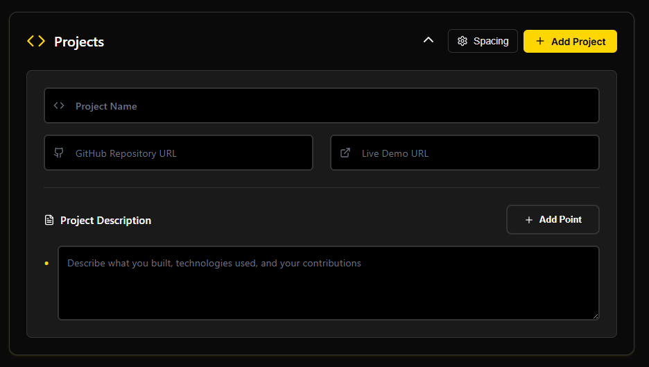

# ResuGen

ResuGen is an innovative web application that provides a live LaTeX resume builder, tailored for users unfamiliar with LaTeX coding. It offers a seamless way to craft ATS-friendly resumes using a simple, guided form interface—trusted by thousands and designed by hiring experts to help your skills shine.

---

## Table of Contents

1. [Demo](#demo)
2. [Features](#features)
3. [Screenshots](#screenshots)
4. [How It Works](#how-it-works)
5. [Getting Started](#getting-started)
6. [Technologies Used](#technologies-used)
7. [License](#license)

---

## Demo

Try the app live: [https://resugen-rg.netlify.app/](https://resugen-rg.netlify.app/)

> **Recommended:** For the best experience, use a desktop browser.

---

## Features

- **Real-time LaTeX Compilation:** Instantly preview your resume as you edit.
- **Download Options:** Export your resume as PDF or LaTeX (.tex) files.
- **Creative UI:** Engaging, professional, and user-friendly interface.
- **Section Control:** Show or hide any resume section as needed.
- **Custom Skill Categories:** Rename skill sections to fit your expertise.
- **Adjustable Spacing:** Select from compact, balanced, or spacious layouts.
- **Local Storage Support:** Your data persists in your browser; reset all with one click.
- **ATS-Friendly:** Designed for compatibility with applicant tracking systems.

---

## Screenshots

Below are sample screenshots of ResuGen in action. (Replace the placeholders with your actual images.)

### 1. Home / Entry Page


### 2. Personal Information Input


### 3. Education Section


### 4. Experience Section


### 5. Skills Section


### 6. Projects Section


### 7. Certifications Section


### 8. Section Visibility & Order Control


## Final Resume Preview


---

## How It Works

1. **Fill Out Simple Forms:** Enter your details in dedicated sections for personal info, education, experience, skills, projects, etc.
2. **Real-Time Preview:** The app compiles your input and displays a live LaTeX-rendered preview.
3. **Customize:** Show/hide sections, rename skill categories, and choose your preferred spacing.
4. **Export:** Download your resume instantly as a polished PDF or the raw LaTeX source.
5. **Persistence:** Your data is saved locally until you reset it.

---

## Getting Started

### Online Usage

No installation required—just visit [https://resugen-rg.netlify.app/](https://resugen-rg.netlify.app/) in your desktop browser.

### Local Installation

To run ResuGen locally:

1. **Clone the repository:**
   ```bash
   git clone https://github.com/Ashish110411/ResuGen.git
   cd ResuGen
   ```

2. **Install dependencies:**
   ```bash
   npm install
   ```

3. **Start the development server:**
   ```bash
   npm start
   ```

4. Open [http://localhost:3000](http://localhost:3000) in your browser.

---

## Technologies Used

- **JavaScript** – Main application logic
- **CSS** – Styling and responsive design
- **HTML** – Structure

---

## Contributing

1. Fork the repository
2. Create a feature branch (`git checkout -b feature/amazing-feature`)
3. Commit your changes (`git commit -m 'Add some amazing feature'`)
4. Push to the branch (`git push origin feature/amazing-feature`)
5. Open a Pull Request

## License

This project is licensed under the MIT License - see the LICENSE file for details.

## Support

For support and questions:
- 📧 Email: ashishchaudhary110411@gmail.com
- 🐛 Issues: [GitHub Issues](https://github.com/Ashish110411/ResuGen/issues)

---

**Version**: 1.4.1  
Built with ❤️ by [Ashish110411](https://github.com/Ashish110411)